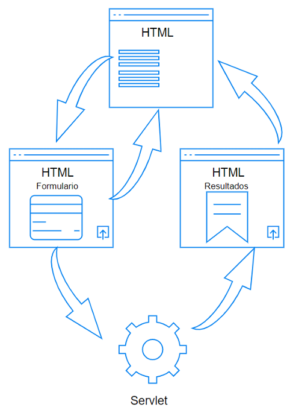
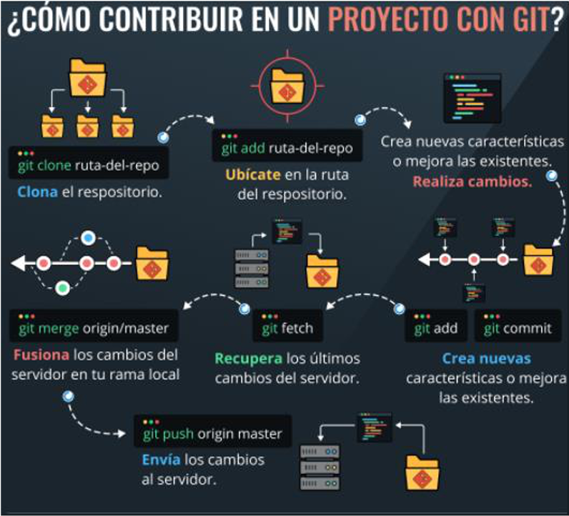

### Introducción 
La presente práctica va a tratar de la trabajo en equipo. 

### Enunciado 
Se quiere realizar una aplicación web Gestión de versiones en sistemas Linux basada en Servlets de JAVA. 
<>
La arquitectura de la aplicación consistirá en una página HTML inicial y principal, con alguna imagen representativa y un menú. Dicho menú contendrá enlaces a otras páginas HTML. En cada una de estas páginas HTML aparecerá un Formulario con uno o varios campos de texto, un enlace/botón para volver a la pantalla principal y un botón para enviar los datos a un Servlet que procesará los datos recogidos del formulario usando el método POST y devolviendo el resultado para mostrarlo en pantalla. Esta otra nueva página web, junto al resultado mostrado, debe tener un enlace/botón para volver a la pantalla principal. 
Todas las páginas web compartirán un único fichero CSS de estilos, para mantener una estética homogénea. 
En los Servlets debemos hacer procesamiento de cadenas. Por ejemplo, poner todo en mayúsculas, poner todo en minúsculas, contar las vocales y las consonantes, etcétera. Cada alumn@ elegirá una única funcionalidad para realizar en su Servlet. 

### Organización 
Lo primero que debe hacer el grupo/equipo, es designar un jefe o jefa de equipo. Será la persona encargada de organizar y coordinar todo el trabajo. También se encargará del desarrollo de la página principal y del diseño (fichero de estilos CSS). Una vez generada la documentación, esta persona subirá un único PDF en la plataforma en el enlace correspondiente. La documentación también es tarea de la jefa o jefe de equipo. 
Por otro lado, los otros integrantes del equipo de trabajo deben realizar: 1. Una página web con un formulario y botón de volver al menú principal. 2. Un Servlet que recoja en formato POST los datos del formulario, y mediante una función, realice una tarea con dichos datos (poner en mayúsculas, en minúsculas, contar vocales y consonantes, …) 3. Otra página web donde se mostrarán los resultados y un botón de volver al menú principal. Esta otra página web puede ser generada directamente con el Servlet, o bien ser una página HTML o JSP independiente. 

### Trabajo compartido
Solamente una rama main común para todos los integrantes del equipo de desarrollo. 
Es muy importante que en la documentación se indique claramente lo aportado por cada persona.
Indicamos a continuación una manera de cómo trabajar en un proyecto en equipo: 
<li>
<ol>Antes de nada, el creador o jefe del proyecto, debe crear un repositorio público en GitHub y debe invitar a los participantes a unirse a él. Es un proceso en dos pasos:</ol>
<li>
<ul>El propietario del repositorio de GitHub busca a los participantes y los invita.</ul>
<ul>Los “participantes” deben aceptar la invitación que les llegará por correo electrónico. Para realizar esta aceptación sin problemas, el usuario debe tener sesión abierta en su cuenta de GitHub.</ul>
</li>
<ol>Contribuir con nuestro trabajo.</ol>
</li>
<>

### Documentación
Se pide documentar y justificar todos los pasos dados para la realización de todo lo indicado, así como posibles problemas, pegas, etc. que os hayáis encontrado. El documento en cuestión debe presentar una portada, listado de integrantes detallando su trabajo, un índice, y como contenido, la creación y la puesta en marcha del proyecto, programas instalados, reuniones celebradas, mecanismos de organización y coordinación seguidos, código de cada fichero HTML y los Servlets, separados por cada integrante del equipo, pantallazos de trabajo en Git y GitHub, pantallazos de pruebas, eventualidades y problemas acaecidos y las soluciones aportadas. Cada trozo de código incluido en la documentación debe venir perfectamente identificado el autor o autora. En caso de que alguien colabore en el proyecto, pero su nombre no aparezca en la primera sección donde aparecen todos o su nombre no aparezca en su código, no será evaluado. Un código sin nombre, es un código huérfano. No olvidad incluir en la documentación la ubicación en GitHub de proyecto. 

### Entrega
En esta práctica debéis entregar un único documento PDF completo con pantallazos, explicaciones, y todo lo necesario para resolver la práctica. Entre la portada y el índice, se debe detallar la composición del equipo, así como el trabajo realizado por cada integrante para su correcta evaluación. 

### Defensa
Esta práctica CARECE de defensa. 

